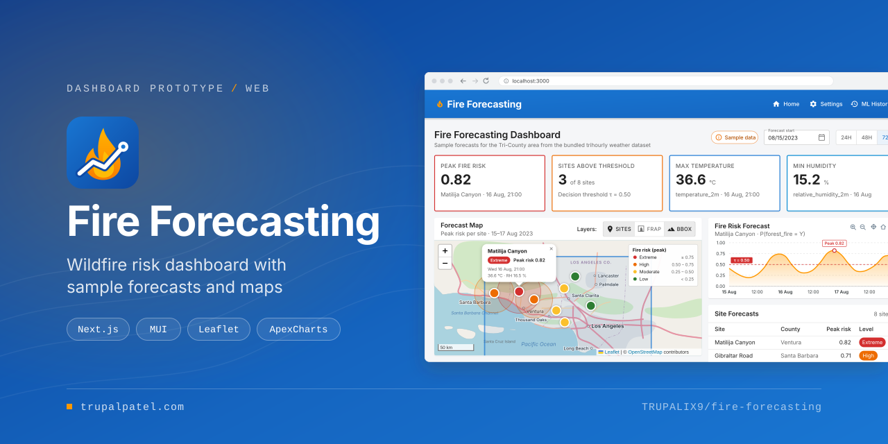
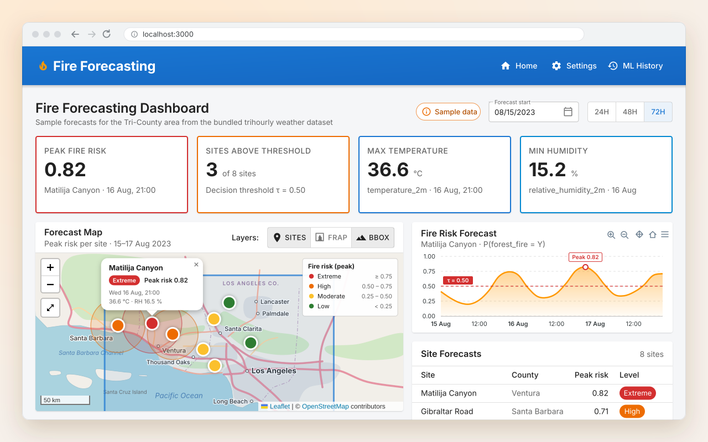
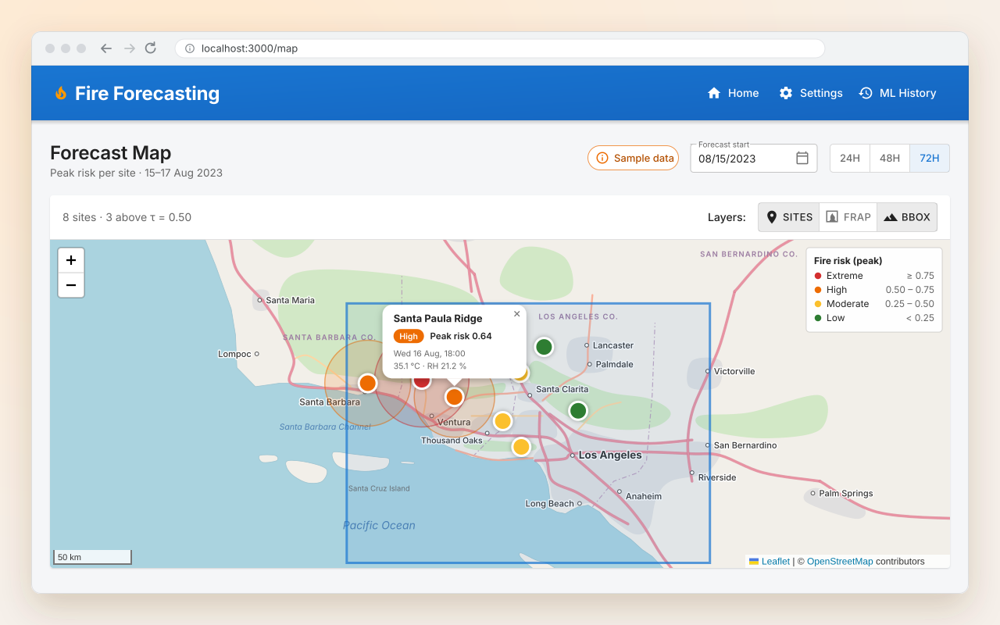
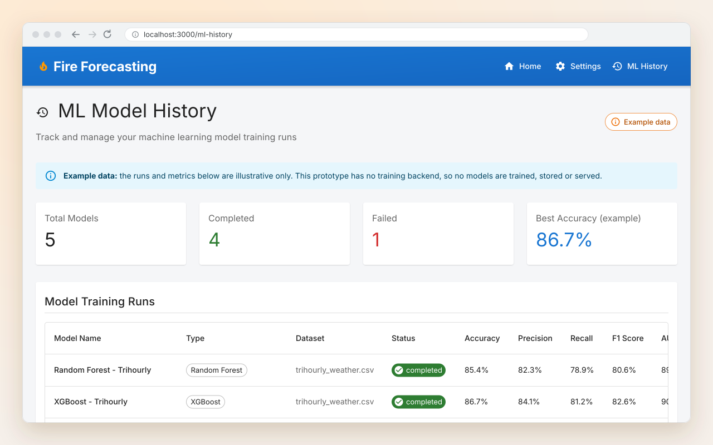
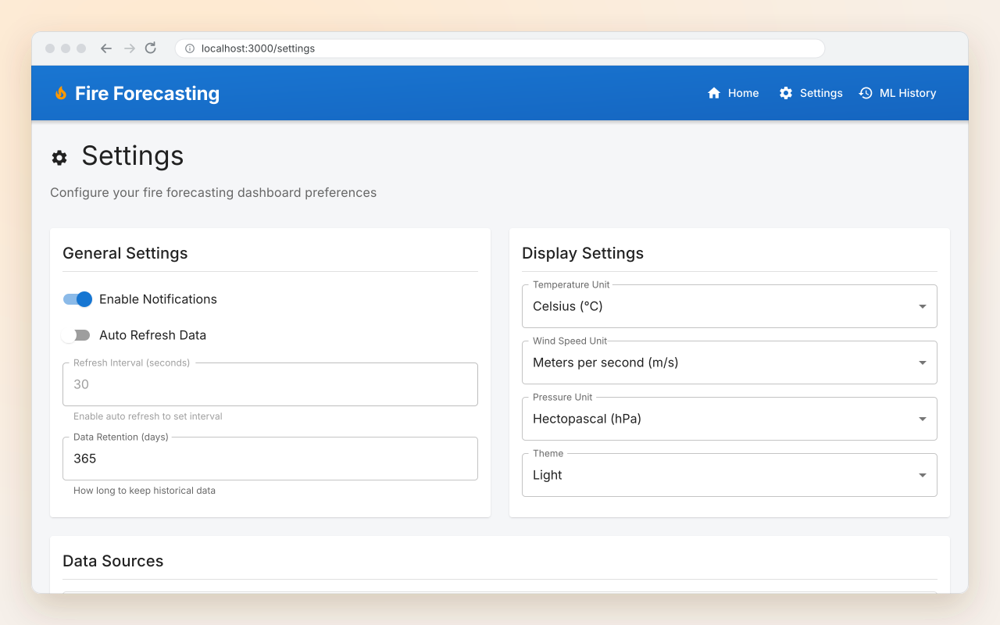
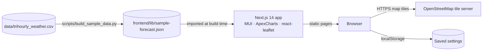

<p align="center">
  
</p>

<p align="center"><strong>A wildfire risk dashboard prototype for the Tri-County area of Southern California, with a forecast map, risk chart and site table running on bundled sample data.</strong></p>

<p align="center">
  <a href="https://trupalpatel.com/projects/fire-forecasting"></a>
  
  
  
  
</p>

<p align="center">
  <a href="https://trupalpatel.com/projects/fire-forecasting"><strong>Case study</strong></a> ·
  <a href="https://trupalpatel.com"><strong>Portfolio</strong></a>
</p>

---

## Overview

Fire Forecasting is a personal project about showing wildfire risk for Santa Barbara, Ventura and Los Angeles counties. This repository is a **dashboard prototype**: a Next.js front end that shows KPI cards, a Leaflet forecast map, an ApexCharts risk chart and a site table, all driven by a small sample dataset bundled with the app.

The weather values come from the committed trihourly weather CSV. The eight monitoring sites and their fire-risk probabilities are **fictional sample data**, and the UI labels them that way. No model is trained or served here.

Earlier versions (up to commit [`300d8da`](https://github.com/TRUPALIX9/fire-forecasting/tree/300d8da)) also had a Python ML pipeline (FIRMS, RAWS and FRAP data, ANN/LSTM models) and a FastAPI backend. Commit `bd4c682` removed them so the project could start again from the front end. That code is only in the git history.

## Features

- **Forecast dashboard**: four KPI cards (peak fire risk, sites above the 0.50 decision threshold, max temperature, min humidity), recomputed for the selected window.
- **Forecast window controls**: a forecast start date and a 24h / 48h / 72h horizon over the 15-17 Aug 2023 sample.
- **Leaflet forecast map**: OpenStreetMap tiles, the Tri-County bounding box, site markers coloured by risk level with popups, risk circles around sites above the threshold, a legend and a scale bar. A full-width view lives at `/map`.
- **Risk chart**: an ApexCharts area chart of the selected site's risk, with threshold and peak annotations. Click a marker or a table row to switch sites.
- **Site forecast table**: every site with its county, peak risk and level chip.
- **Settings**: display and data preferences saved in the browser (localStorage), with input validation.
- **ML History**: a model-run table and KPI cards, clearly marked as example data.
- **Reproducible sample data**: `scripts/build_sample_data.py` rebuilds the bundled JSON from the CSV.

## Screenshots

<table>
  <tr>
    <td align="center" width="50%">
      
      <br /><sub><b>Dashboard</b>: KPIs, forecast map, risk chart and site table</sub>
    </td>
    <td align="center" width="50%">
      
      <br /><sub><b>Forecast Map</b>: full-width map with layers, legend and site popups</sub>
    </td>
  </tr>
  <tr>
    <td align="center" width="50%">
      
      <br /><sub><b>ML History</b>: model runs, labelled as example data</sub>
    </td>
    <td align="center" width="50%">
      
      <br /><sub><b>Settings</b>: general and display preferences, saved in the browser</sub>
    </td>
  </tr>
</table>

<sub>Screens are recreated from the app's real UI in SVG, filled with fictional demo data.</sub>

## Architecture



A Python script copies the 15-17 Aug 2023 weather rows from the CSV and adds the fictional sites and sample risk series. The JSON it writes is imported by `frontend/lib/forecast.ts`, which slices it to the selected forecast window for every page. Leaflet and ApexCharts load on the client only (`next/dynamic` with `ssr: false`). The only network calls at runtime are the map tile requests.

## Tech stack

| Layer | Technology |
|---|---|
| App | Next.js 14.2 (App Router), React 18, TypeScript 5 |
| UI | MUI 5 with Emotion and `@mui/material-nextjs`, Inter via `next/font` |
| Maps and charts | Leaflet 1.9 with react-leaflet 4, ApexCharts 4 with react-apexcharts |
| Data | Trihourly weather CSV, Python 3 (standard library) script, bundled JSON |
| Tooling | npm, ESLint (`next/core-web-vitals`), Makefile |

## Getting started

### Prerequisites

- Node.js 18.17 or newer (required by Next.js 14.2)
- npm (the repo has a `package-lock.json`)
- Python 3, only if you want to regenerate the sample data

### Install

```bash
git clone https://github.com/TRUPALIX9/fire-forecasting.git
cd fire-forecasting/frontend
npm ci
```

No environment variables are needed.

### Run

```bash
npm run dev          # http://localhost:3000
```

Other commands (from `frontend/`):

```bash
npm run typecheck    # tsc --noEmit
npm run lint         # next lint
npm run build        # production build
npm start            # serve the production build
```

From the repository root, `make install`, `make run-frontend`, `make build` and `make sample-data` wrap the same steps. `make sample-data` runs `python3 scripts/build_sample_data.py` and rewrites `frontend/lib/sample-forecast.json`.

## Project structure

```text
fire-forecasting/
├── data/
│   └── trihourly_weather.csv     # committed weather data (see docs/DATASET.md)
├── docs/
│   ├── DATASET.md                # dataset facts, source and data-quality caveats
│   └── assets/                   # README banner, logo, icon and screens
├── frontend/
│   ├── app/                      # Next.js routes: /, /map, /settings, /ml-history
│   │   └── components/           # KPI cards, map, chart, table, header, controls
│   └── lib/                      # sample-forecast.json and forecast helpers
├── scripts/
│   └── build_sample_data.py      # builds the bundled sample forecast
├── Makefile                      # install / run / build / sample-data shortcuts
└── PROJECT_SUMMARY.md            # short project summary and history
```

## Data

`data/trihourly_weather.csv` holds 18,069 rows of 3-hourly weather and fire labels from 2020-01-01 to 2024-01-01, processed by the [fire-prediction](https://github.com/gauravsurtani/fire-prediction) project. It has known quality issues (repeated timestamps with no location column, one empty row, some time mismatches). They are listed in [docs/DATASET.md](docs/DATASET.md).

## Roadmap

- [ ] Rebuild a backend and model service for real forecasts <sub>(commit bd4c682: "Removed backedn will create new")</sub>

## Author

**Trupal Patel**

<p>
  <a href="https://trupalpatel.com">Portfolio</a> ·
  <a href="mailto:trupal.work@gmail.com">trupal.work@gmail.com</a> ·
  <a href="https://www.linkedin.com/in/trupalix">LinkedIn</a> ·
  <a href="https://github.com/TRUPALIX9">GitHub</a>
</p>
